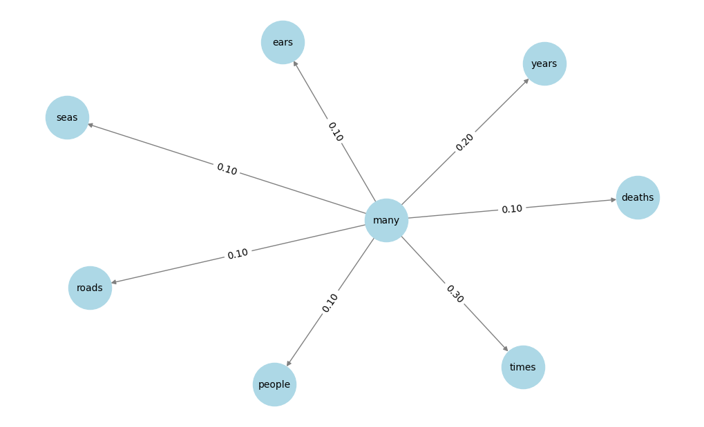

---
authors:
  - d33kshant
categories:
  - Mini Projects
date: 2024-06-05
description: >-
    This mini project demonstrates how to make a Hidden Markov Model (HMM) which uses probability based language modeling to create a very minimal language model which can generate new sentances.
---

# HMM A Minimal Language Model

This mini project demonstrates how to make a Hidden Markov Model (HMM) which uses probability based language modeling to create a very minimal language model which can generate new sentances.

<!-- more -->

[](https://colab.research.google.com/drive/1Y9I-IkZ3Q-dykvCpXLqcIoLoXMuwKkdf?usp=sharing)

???+ info "Disclaimer"
    This project uses the lyrics of "Blowin’ in the Wind" by Bob Dylan for educational purposes only. I do not claim ownership of the song. You can use any textual data of your own.


A Hidden Markov Model (HMM) models language by treating words as states and transitions between them as probabilities based on observed text data. It learns a transition probability matrix, where each word has a likelihood of leading to another word, based on how often they appear together in the training text.

For example here is a transition probability for word "many" in the song "Blowin' In The Wind" by Bob Dylan. This graph can be used to predict what could be the next word after the word "many"

{ width="600" }
/// caption
Transition Probability for word "many"
///

Sentence generation follows a Markov process, starting from an initial word and selecting the next word based on the learned probabilities, forming a probabilistic chain. This approach enables the model to generate coherent sentences by predicting the most likely sequences, even without explicit grammar rules.

> This project is inspired by a YouTube video on Large Language Model by "Graphics in 5 Minutes" which you can find [here](https://www.youtube.com/watch?v=lnA9DMvHtfI)

## Importing the required libraries

```python
import numpy as np
import random
from collections import defaultdict
```

## Loadig The Lyrics

```python
lyrics = """
How many roads must a man walk down
...
The answer is blowin' in the wind
"""
```

## Create Hidden Markov Model

```python
def create_hmm(text):
    words = text.split()
    transitions = defaultdict(lambda: defaultdict(int))
    
    for i in range(len(words) - 1):
        transitions[words[i]][words[i + 1]] += 1
    
    transition_probs = {}
    for word, next_words in transitions.items():
        total = sum(next_words.values())
        transition_probs[word] = {k: v / total for k, v in next_words.items()}
    
    return transition_probs
```

## Generate New Sentance

```python
def generate_sentence(transition_probs, start_word=None, length=10):
    if start_word is None:
        start_word = random.choice(list(transition_probs.keys()))
    
    sentence = [start_word]
    for _ in range(length - 1):
        if start_word not in transition_probs:
            break
        next_word = random.choices(
            list(transition_probs[start_word].keys()),
            weights=list(transition_probs[start_word].values())
        )[0]
        sentence.append(next_word)
        start_word = next_word
    
    return ' '.join(sentence)
```

## Sentance Starting With "The"

```python
hmm = create_hmm(lyrics)
print(generate_sentence(hmm, start_word="The"))
```
<div class="result" markdown>
<pre>
The answer, my friend, is blowin' in the sea? Yes,
</pre>
</div>