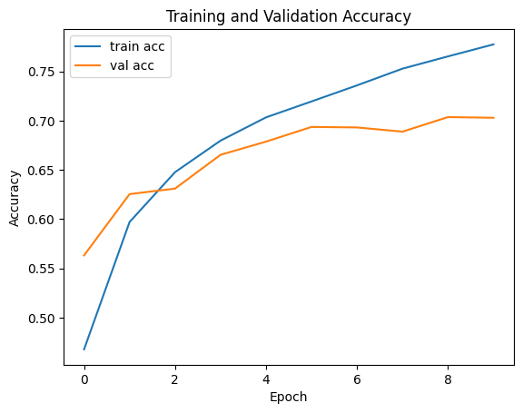
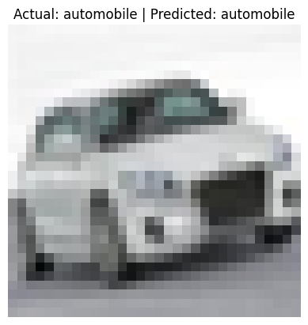

---
authors:
  - d33kshant
date: 2024-07-13
pin: true
categories:
  - Tutorial
description: >-
  Convolutional Neural Networks (CNNs) are a class of deep learning models that excel at working with image data. Instead of processing each pixel independently (like in a fully connected neural network), CNNs use filters (or kernels) to scan across the image, capturing spatial hierarchies and local patterns like edges, textures, and shapes.
---

# Implementing Convolutional Neural Networks using Tensorflow

Convolutional Neural Networks (CNNs) are a class of deep learning models that excel at working with image data. Instead of processing each pixel independently (like in a fully connected neural network), CNNs use filters (or kernels) to scan across the image, capturing spatial hierarchies and local patterns like edges, textures, and shapes.

<!-- more -->

CNNs consist of layers such as:

-   Convolutional layers, which apply learnable filters to detect features.

-   ReLU activations, which introduce non-linearity.

-   Pooling layers, which reduce spatial size and help generalize.

-   Fully connected layers, which perform final classification based on extracted features.

This architecture allows CNNs to automatically learn useful features from raw pixel data with minimal pre-processing. They're widely used in image recognition, medical imaging, self-driving cars, and more.

## Implementation of CNN using Tensorflow

### 1. Import Libraries

```python
import tensorflow as tf
from tensorflow.keras import layers, models
import matplotlib.pyplot as plt
import numpy as np
```

### 2. Load and Preprocess the Dataset

```python
(x_train, y_train), (x_test, y_test) = tf.keras.datasets.cifar10.load_data()

x_train = x_train.astype('float32') / 255.0
x_test = x_test.astype('float32') / 255.0

y_train = tf.keras.utils.to_categorical(y_train, 10)
y_test = tf.keras.utils.to_categorical(y_test, 10)
```
<div class="result" style="overflow-x: auto;" markdown>
<pre style="font-size: .85em;">Downloading data from <a rel="nofollow" target="_blank" href="https://www.cs.toronto.edu/~kriz/cifar-10-python.tar.gz">https://www.cs.toronto.edu/~kriz/cifar-10-python.tar.gz</a>
<span style="font-weight: bold;">170498071/170498071</span><span> </span><span style="color: var(--ansi-green);">━━━━━━━━━━━━━━━━━━━━</span><span> </span><span style="font-weight: bold;">3s</span><span> 0us/step
</span></pre>
</div>

The CIFAR-10 dataset contains 60,000 32x32 color images in 10 categories. We normalize the image data and one-hot encode the labels for training.

### 3. Build the CNN Model

```python
model = models.Sequential([
    layers.Input((32, 32, 3)),
    layers.Conv2D(32, (3, 3), activation='relu'),
    layers.MaxPooling2D((2, 2)),

    layers.Conv2D(64, (3, 3), activation='relu'),
    layers.MaxPooling2D((2, 2)),

    layers.Flatten(),
    layers.Dense(64, activation='relu'),
    layers.Dense(10, activation='softmax')  # 10 classes
], name="simple-cnn")

model.summary()
```
<div class="result" markdown style="font-size: .85em; overflow-x: auto;">
<div id="output-area"><span id="output-header"> </span><div id="output-body"><div class="display_data output-id-1"><div class="output_subarea output_html rendered_html"><pre style="white-space:pre;overflow-x:auto;line-height:normal;font-family:Menlo,'DejaVu Sans Mono',consolas,'Courier New',monospace"><span style="font-weight: bold">Model: "simple-cnn"</span>
</pre>
</div></div><div class="display_data output-id-2"><div class="output_subarea output_html rendered_html"><pre style="white-space:pre;overflow-x:auto;line-height:normal;font-family:Menlo,'DejaVu Sans Mono',consolas,'Courier New',monospace">┏━━━━━━━━━━━━━━━━━━━━━━━━━━━━━━━━━━━━━━┳━━━━━━━━━━━━━━━━━━━━━━━━━━━━━┳━━━━━━━━━━━━━━━━━┓
┃<span style="font-weight: bold"> Layer (type)                         </span>┃<span style="font-weight: bold"> Output Shape                </span>┃<span style="font-weight: bold">         Param # </span>┃
┡━━━━━━━━━━━━━━━━━━━━━━━━━━━━━━━━━━━━━━╇━━━━━━━━━━━━━━━━━━━━━━━━━━━━━╇━━━━━━━━━━━━━━━━━┩
│ conv2d (<span style="color: #0087ff; text-decoration-color: #0087ff">Conv2D</span>)                      │ (<span style="color: #00d7ff; text-decoration-color: #00d7ff">None</span>, <span style="color: #00af00; text-decoration-color: #00af00">30</span>, <span style="color: #00af00; text-decoration-color: #00af00">30</span>, <span style="color: #00af00; text-decoration-color: #00af00">32</span>)          │             <span style="color: #00af00; text-decoration-color: #00af00">896</span> │
├──────────────────────────────────────┼─────────────────────────────┼─────────────────┤
│ max_pooling2d (<span style="color: #0087ff; text-decoration-color: #0087ff">MaxPooling2D</span>)         │ (<span style="color: #00d7ff; text-decoration-color: #00d7ff">None</span>, <span style="color: #00af00; text-decoration-color: #00af00">15</span>, <span style="color: #00af00; text-decoration-color: #00af00">15</span>, <span style="color: #00af00; text-decoration-color: #00af00">32</span>)          │               <span style="color: #00af00; text-decoration-color: #00af00">0</span> │
├──────────────────────────────────────┼─────────────────────────────┼─────────────────┤
│ conv2d_1 (<span style="color: #0087ff; text-decoration-color: #0087ff">Conv2D</span>)                    │ (<span style="color: #00d7ff; text-decoration-color: #00d7ff">None</span>, <span style="color: #00af00; text-decoration-color: #00af00">13</span>, <span style="color: #00af00; text-decoration-color: #00af00">13</span>, <span style="color: #00af00; text-decoration-color: #00af00">64</span>)          │          <span style="color: #00af00; text-decoration-color: #00af00">18,496</span> │
├──────────────────────────────────────┼─────────────────────────────┼─────────────────┤
│ max_pooling2d_1 (<span style="color: #0087ff; text-decoration-color: #0087ff">MaxPooling2D</span>)       │ (<span style="color: #00d7ff; text-decoration-color: #00d7ff">None</span>, <span style="color: #00af00; text-decoration-color: #00af00">6</span>, <span style="color: #00af00; text-decoration-color: #00af00">6</span>, <span style="color: #00af00; text-decoration-color: #00af00">64</span>)            │               <span style="color: #00af00; text-decoration-color: #00af00">0</span> │
├──────────────────────────────────────┼─────────────────────────────┼─────────────────┤
│ flatten (<span style="color: #0087ff; text-decoration-color: #0087ff">Flatten</span>)                    │ (<span style="color: #00d7ff; text-decoration-color: #00d7ff">None</span>, <span style="color: #00af00; text-decoration-color: #00af00">2304</span>)                │               <span style="color: #00af00; text-decoration-color: #00af00">0</span> │
├──────────────────────────────────────┼─────────────────────────────┼─────────────────┤
│ dense (<span style="color: #0087ff; text-decoration-color: #0087ff">Dense</span>)                        │ (<span style="color: #00d7ff; text-decoration-color: #00d7ff">None</span>, <span style="color: #00af00; text-decoration-color: #00af00">64</span>)                  │         <span style="color: #00af00; text-decoration-color: #00af00">147,520</span> │
├──────────────────────────────────────┼─────────────────────────────┼─────────────────┤
│ dense_1 (<span style="color: #0087ff; text-decoration-color: #0087ff">Dense</span>)                      │ (<span style="color: #00d7ff; text-decoration-color: #00d7ff">None</span>, <span style="color: #00af00; text-decoration-color: #00af00">10</span>)                  │             <span style="color: #00af00; text-decoration-color: #00af00">650</span> │
└──────────────────────────────────────┴─────────────────────────────┴─────────────────┘
</pre>
</div></div><div class="display_data output-id-3"><div class="output_subarea output_html rendered_html"><pre style="white-space:pre;overflow-x:auto;line-height:normal;font-family:Menlo,'DejaVu Sans Mono',consolas,'Courier New',monospace"><span style="font-weight: bold"> Total params: </span><span style="color: #00af00; text-decoration-color: #00af00">167,562</span> (654.54 KB)
</pre>
</div></div><div class="display_data output-id-4"><div class="output_subarea output_html rendered_html"><pre style="white-space:pre;overflow-x:auto;line-height:normal;font-family:Menlo,'DejaVu Sans Mono',consolas,'Courier New',monospace"><span style="font-weight: bold"> Trainable params: </span><span style="color: #00af00; text-decoration-color: #00af00">167,562</span> (654.54 KB)
</pre>
</div></div><div class="display_data output-id-5"><div class="output_subarea output_html rendered_html"><pre style="white-space:pre;overflow-x:auto;line-height:normal;font-family:Menlo,'DejaVu Sans Mono',consolas,'Courier New',monospace"><span style="font-weight: bold"> Non-trainable params: </span><span style="color: #00af00; text-decoration-color: #00af00">0</span> (0.00 B)
</pre>
</div></div></div><span id="output-footer"></span></div>
</div>


This simple CNN has two convolutional layers followed by max-pooling layers. After flattening the features, it passes through two dense layers to produce a probability distribution over the 10 classes.

This is a basic convolutional neural network (CNN) that you’ll often see in introductory deep learning tutorials. This model is inspired by LeNet.

### 4.  Compile and Training the Model

```python
model.compile(
    optimizer='adam',
    loss='categorical_crossentropy',
    metrics=['accuracy'],
)
```

```python
history = model.fit(x_train, y_train, epochs=10, batch_size=64, validation_data=(x_test, y_test), )
```

<div class="result" markdown style="font-size: .85em; overflow-x: auto;">
<pre>Epoch 1/10
<span style="font-weight: bold;">782/782</span><span> </span><span style="color: var(--ansi-green);">━━━━━━━━━━━━━━━━━━━━</span><span> </span><span style="font-weight: bold;">10s</span><span> 7ms/step - accuracy: 0.3820 - loss: 1.7106 - val_accuracy: 0.5632 - val_loss: 1.2533
Epoch 2/10
</span><span style="font-weight: bold;">782/782</span><span> </span><span style="color: var(--ansi-green);">━━━━━━━━━━━━━━━━━━━━</span><span> </span><span style="font-weight: bold;">4s</span><span> 5ms/step - accuracy: 0.5817 - loss: 1.1892 - val_accuracy: 0.6254 - val_loss: 1.0929
Epoch 3/10
</span><span style="font-weight: bold;">782/782</span><span> </span><span style="color: var(--ansi-green);">━━━━━━━━━━━━━━━━━━━━</span><span> </span><span style="font-weight: bold;">3s</span><span> 4ms/step - accuracy: 0.6421 - loss: 1.0342 - val_accuracy: 0.6310 - val_loss: 1.0580
Epoch 4/10
</span><span style="font-weight: bold;">782/782</span><span> </span><span style="color: var(--ansi-green);">━━━━━━━━━━━━━━━━━━━━</span><span> </span><span style="font-weight: bold;">5s</span><span> 4ms/step - accuracy: 0.6757 - loss: 0.9403 - val_accuracy: 0.6653 - val_loss: 0.9575
Epoch 5/10
</span><span style="font-weight: bold;">782/782</span><span> </span><span style="color: var(--ansi-green);">━━━━━━━━━━━━━━━━━━━━</span><span> </span><span style="font-weight: bold;">5s</span><span> 4ms/step - accuracy: 0.7016 - loss: 0.8715 - val_accuracy: 0.6787 - val_loss: 0.9492
Epoch 6/10
</span><span style="font-weight: bold;">782/782</span><span> </span><span style="color: var(--ansi-green);">━━━━━━━━━━━━━━━━━━━━</span><span> </span><span style="font-weight: bold;">3s</span><span> 4ms/step - accuracy: 0.7199 - loss: 0.8115 - val_accuracy: 0.6936 - val_loss: 0.8958
Epoch 7/10
</span><span style="font-weight: bold;">782/782</span><span> </span><span style="color: var(--ansi-green);">━━━━━━━━━━━━━━━━━━━━</span><span> </span><span style="font-weight: bold;">3s</span><span> 4ms/step - accuracy: 0.7385 - loss: 0.7540 - val_accuracy: 0.6931 - val_loss: 0.9070
Epoch 8/10
</span><span style="font-weight: bold;">782/782</span><span> </span><span style="color: var(--ansi-green);">━━━━━━━━━━━━━━━━━━━━</span><span> </span><span style="font-weight: bold;">5s</span><span> 4ms/step - accuracy: 0.7550 - loss: 0.7088 - val_accuracy: 0.6888 - val_loss: 0.9137
Epoch 9/10
</span><span style="font-weight: bold;">782/782</span><span> </span><span style="color: var(--ansi-green);">━━━━━━━━━━━━━━━━━━━━</span><span> </span><span style="font-weight: bold;">3s</span><span> 4ms/step - accuracy: 0.7671 - loss: 0.6708 - val_accuracy: 0.7036 - val_loss: 0.8936
Epoch 10/10
</span><span style="font-weight: bold;">782/782</span><span> </span><span style="color: var(--ansi-green);">━━━━━━━━━━━━━━━━━━━━</span><span> </span><span style="font-weight: bold;">6s</span><span> 4ms/step - accuracy: 0.7799 - loss: 0.6332 - val_accuracy: 0.7029 - val_loss: 0.9034
</span></pre>
</div>

```python
plt.plot(history.history['accuracy'], label='train acc')
plt.plot(history.history['val_accuracy'], label='val acc')
plt.xlabel('Epoch')
plt.ylabel('Accuracy')
plt.legend()
plt.title('Training and Validation Accuracy')
plt.show()
```
<div class="result" markdown>

{ width="400" }

</div>

### 5. Evaluate the Model
```python
test_loss, test_acc = model.evaluate(x_test, y_test)
print(f'Test accuracy: {test_acc:.4f}')
```
<div class="result" style="overflow-x: auto;" markdown>
<pre><span style="font-weight: bold;">313/313</span><span> </span><span style="color: var(--ansi-green);">━━━━━━━━━━━━━━━━━━━━</span><span> </span><span style="font-weight: bold;">1s</span><span> 2ms/step - accuracy: 0.7010 - loss: 0.9037
Test accuracy: 0.7029
</span></pre>
</div>

### 6. Sample Prediction

```python
class_names = ['airplane', 'automobile', 'bird', 'cat', 'deer',
               'dog', 'frog', 'horse', 'ship', 'truck']

index = np.random.randint(len(x_test))
sample_image = x_test[index]
true_label = np.argmax(y_test[index])

prediction = model.predict(np.expand_dims(sample_image, axis=0))
predicted_label = np.argmax(prediction)
```
<div class="result" markdown>
<pre><span style="font-weight: bold;">1/1</span><span> </span><span style="color: var(--ansi-green);">━━━━━━━━━━━━━━━━━━━━</span><span> </span><span style="font-weight: bold;">0s</span><span> 29ms/step
</span></pre>
</div>

```python
plt.imshow(sample_image)
plt.title(f"Actual: {class_names[true_label]} | Predicted: {class_names[predicted_label]}")
plt.axis('off')
plt.show()
```
<div class="result" markdown>
{ width="300" }
</div>

## Conclusion

We explored what Convolutional Neural Networks (CNNs) are and how to implement a simple one using TensorFlow and Keras. While this model is simple, it's a strong foundation for understanding how more advanced architectures work. CNNs are powerful tools for working with image data because they can automatically learn meaningful patterns and hierarchies from raw pixels.