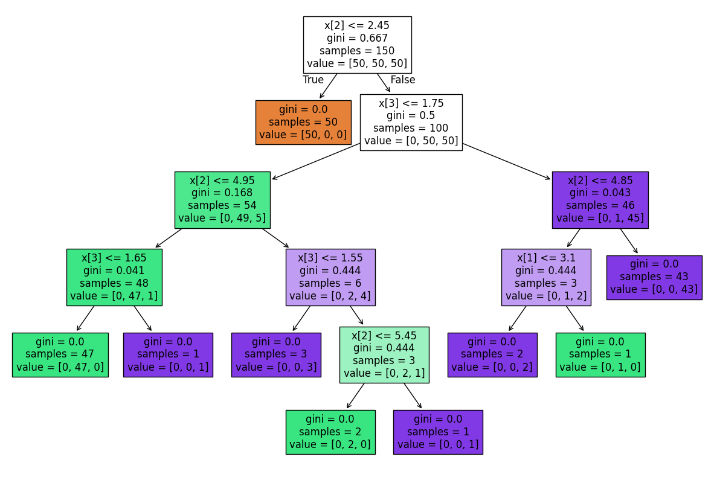

---
authors:
  - d33kshant
categories:
  - Tutorial
date: 2024-05-30
description: >-
    Decision trees are powerful models that simulate human decision-making by breaking down complex problems into clear, step-by-step choices. They are widely used for classification and regression tasks, providing intuitive and interpretable results.
---

# Implementing Decision Tree from Scratch

Decision trees are powerful models that simulate human decision-making by breaking down complex problems into clear, step-by-step choices. They are widely used for classification and regression tasks, providing intuitive and interpretable results.

<!-- more -->

[](https://colab.research.google.com/drive/1z8F_i4kNYndX4swg8C92hWw9GOPUsnx_)

???+ abstract "AI Summary"
    This blog offers a detailed exploration of decision trees, focusing on their mathematical foundations and practical applications. It explains concepts like Gini impurity, information gain, and data splitting, providing a clear understanding of how decision trees make decisions. Through a step-by-step approach, readers gain insights into building and evaluating decision trees. The blog concludes with a comparison to a standard implementation, reinforcing the learning experience.

## What is Decision Tree
A decision tree is a supervised machine learning algorithm used for classification and regression tasks. It is a tree-like structure where each internal node represents a decision based on a specific feature, each branch represents the outcome of that decision, and each leaf node provides the final prediction.

## Understanding Decision Tree

The core idea behind decision trees is to minimize impurity when making splits. The impurity of a node can be measured using metrics like:

1. **Gini Impurity**:  measure of how mixed or impure a dataset is, commonly used in decision tree algorithms to determine the best way to split data for classification

    $$
    Gini(D) = 1 - \sum_{i=1}^{C} p_i^2
    $$

    where \(p_i\) is the probability of class \(i\) in the dataset \(D\).

2. **Entropy**: Entropy measures the disorder or randomness in a dataset. It's calculated by summing the weighted probabilities of each possible outcome, using the logarithm of the probabilities

    $$
    H(D) = - \sum_{i=1}^{C} p_i \log_2 p_i
    $$

    The goal is to select the split that results in the lowest weighted impurity of the child nodes.
    
3. **Information Gain**: Information gain measures the reduction in entropy (or increase in purity) achieved by splitting a dataset on a particular feature, The information gain for a split is calculated as:

    $$
    IG = H(D) - \sum_{i=1}^{k} \frac{|D_i|}{|D|} H(D_i)
    $$

    where \(D_i\) represents the subsets resulting from the split.


## Implementation of Decision Tree 

### 1. Import Libraries and Load the Dataset

```python
iris = datasets.load_iris()
data = pd.DataFrame(data= np.c_[iris['data'], iris['target']], columns= iris['feature_names'] + ['target'])
data.head()
```

<div class="result">
    <table>
        <thead>
            <tr style="text-align: right;">
            <th></th>
            <th>sepal length (cm)</th>
            <th>sepal width (cm)</th>
            <th>petal length (cm)</th>
            <th>petal width (cm)</th>
            <th>target</th>
            </tr>
        </thead>
        <tbody>
            <tr>
            <th>0</th>
            <td>5.1</td>
            <td>3.5</td>
            <td>1.4</td>
            <td>0.2</td>
            <td>0.0</td>
            </tr>
            <tr>
            <th>1</th>
            <td>4.9</td>
            <td>3.0</td>
            <td>1.4</td>
            <td>0.2</td>
            <td>0.0</td>
            </tr>
            <tr>
            <th>2</th>
            <td>4.7</td>
            <td>3.2</td>
            <td>1.3</td>
            <td>0.2</td>
            <td>0.0</td>
            </tr>
            <tr>
            <th>3</th>
            <td>4.6</td>
            <td>3.1</td>
            <td>1.5</td>
            <td>0.2</td>
            <td>0.0</td>
            </tr>
            <tr>
            <th>4</th>
            <td>5.0</td>
            <td>3.6</td>
            <td>1.4</td>
            <td>0.2</td>
            <td>0.0</td>
            </tr>
        </tbody>
    </table>
</div>

This block imports the necessary libraries, loads the Iris dataset using `sklearn.datasets`, and converts it into a pandas DataFrame for easier manipulation.


### 2. Calculate Gini Impurity

```python
def gini_impurity(y):
    classes, counts = np.unique(y, return_counts=True)
    probabilities = counts / len(y)
    return 1 - np.sum(probabilities ** 2)
```

This function calculates the Gini impurity of a given set of labels. It is used to measure how impure a node is, with 0 indicating perfect purity.

### 3. Perform Data Splitting

```python
def split_data(X, y, feature_index, threshold):
    left_mask = X[:, feature_index] <= threshold
    right_mask = ~left_mask
    return X[left_mask], X[right_mask], y[left_mask], y[right_mask]
```

This function splits the dataset based on a specified feature and threshold. It returns the left and right subsets of features and labels.

### 4. Calculate Information Gain

```python
def information_gain(X, y, feature_index, threshold):
    parent_impurity = gini_impurity(y)
    X_left, X_right, y_left, y_right = split_data(X, y, feature_index, threshold)
    n = len(y)
    left_weight = len(y_left) / n
    right_weight = len(y_right) / n
    gain = parent_impurity - (left_weight * gini_impurity(y_left) + right_weight * gini_impurity(y_right))
    return gain
```

This function calculates the information gain from splitting the data using a specific feature and threshold.

### 5. Find the Best Split

```python
def find_best_split(X, y):
    best_gain = 0
    best_feature = None
    best_threshold = None
    for feature_index in range(X.shape[1]):
        thresholds = np.unique(X[:, feature_index])
        for threshold in thresholds:
            gain = information_gain(X, y, feature_index, threshold)
            if gain > best_gain:
                best_gain = gain
                best_feature = feature_index
                best_threshold = threshold
    return best_feature, best_threshold
```

This function iterates over all features and possible thresholds to find the best split with the highest information gain.


### 6. Build the Decision Tree Recursively

```python
def build_tree(X, y, depth=0, max_depth=5):
    if len(np.unique(y)) == 1 or depth == max_depth:
        return np.argmax(np.bincount(y.astype(int)))
    
    feature_index, threshold = find_best_split(X, y)
    if feature_index is None:
        return np.argmax(np.bincount(y.astype(int)))
    
    X_left, X_right, y_left, y_right = split_data(X, y, feature_index, threshold)
    left_subtree = build_tree(X_left, y_left, depth + 1, max_depth)
    right_subtree = build_tree(X_right, y_right, depth + 1, max_depth)

    return (feature_index, threshold, left_subtree, right_subtree)
```

This recursive function builds the decision tree by selecting the best split, creating subtrees, and returning the tree structure as a tuple.

### 7. Make Predictions

```python
def predict(sample, tree):
    if isinstance(tree, int):
        return tree
    feature_index, threshold, left_subtree, right_subtree = tree
    if sample[feature_index] <= threshold:
        return predict(sample, left_subtree)
    else:
        return predict(sample, right_subtree)
```

This function traverses the tree for a given input sample and returns the predicted class.

### 8. Running and Evaluating The Model

```python
X = data.iloc[:, :-1].values
y = data.iloc[:, -1].values

tree = build_tree(X, y)
predictions = [predict(sample, tree) for sample in X]
accuracy = np.sum(predictions == y) / len(y)
print(f"Accuracy: {accuracy * 100:.2f}%")
```
<div class="result" markdown>
Accuracy: 100.00%
</div>

## Using Scikit-learn for Decision Tree

```python
from sklearn.tree import DecisionTreeClassifier, plot_tree
from sklearn.metrics import accuracy_score
from matplotlib import pyplot as plt

X = data.iloc[:, :-1].values
y = data.iloc[:, -1].values

clf = DecisionTreeClassifier()
clf.fit(X, y)

y_pred = clf.predict(X)
print(f"Accuracy: {accuracy_score(y, y_pred) * 100:.2f}%")

plt.figure(figsize=(15, 10))
plot_tree(clf, filled=True)
plt.show()
```
<div class="result" markdown>
Accuracy: 100.00%

</div>

Here `x[2]` is the petal length, `x[3]` is the petal width, orange color represents `setosa`, green represents `versicolor`, and purple represents `virginica`

## Conclusion

In this blog, we learned how decision trees work by implementing one from scratch using NumPy and pandas in a functional, procedural style. We calculated Gini impurity, found the best split using information gain, and recursively built a tree. After that, we compared our implementation with the `scikit-learn` decision tree classifier. This exercise helps in building a solid understanding of decision trees, which are a foundation for more advanced algorithms like random forests and gradient boosting.
