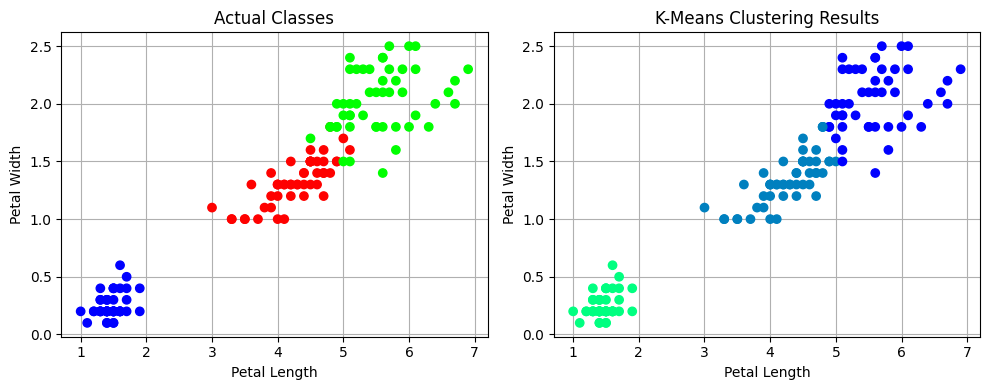

---
authors:
  - d33kshant
categories:
  - Tutorial
date: 2024-06-03
description: >-
    K-Means clustering is one of the simplest and most effective unsupervised machine learning algorithms. It is widely used for tasks such as customer segmentation and anomaly detection
---

# Implementing K Means Clustering From Scratch

K-Means clustering is one of the simplest and most effective unsupervised machine learning algorithms. It is widely used for tasks such as customer segmentation and anomaly detection

<!-- more -->

[](https://colab.research.google.com/drive/1NbffALDL_jOCxpsEQTvxoBAqcKfaHP9Z)

???+ abstract "AI Summary"
    This blog provides a comprehensive tutorial on K-Means clustering, an unsupervised machine learning algorithm used for grouping data into clusters. It explains the algorithm's steps, including initialization, assignment, and update phases, and demonstrates a from-scratch implementation using NumPy and Pandas on the Iris dataset. The tutorial covers both manual implementation and Scikit-Learn's approach, showcasing how the algorithm works through code, mathematical formulas, and visualization of clustering results.

In this blog, we'll break down the concept of K-Means clustering, implement it from scratch using NumPy and Pandas, and apply it to the famous Iris dataset. We'll follow a procedural, function-based approach, just like you would in a Jupyter notebook. Finally, we'll see how to implement the same using Scikit-Learn.

## What is K-Means Clustering?

K-Means clustering is an **unsupervised learning algorithm** used to group data into \( k \) clusters. The goal is to minimize the variance within each cluster, ensuring data points in the same cluster are as similar as possible.

### Steps of K-Means Algorithm
1. **Initialization**: Choose \( k \) initial cluster centroids randomly.
2. **Assignment**: Assign each data point to the nearest centroid using the Euclidean distance formula:

\[
\text{Distance} = \sqrt{\sum_{i=1}^{n}(x_i - \mu_i)^2}
\]

3. **Update**: Calculate new centroids as the mean of all points in a cluster.

\[
\mu_k = \frac{1}{N_k} \sum_{i=1}^{N_k} x_i
\]

4. **Repeat**: Perform the assignment and update steps until centroids no longer change or a maximum number of iterations is reached.

## Implementation K Means Clustering

### 1. Importing Libraries

```python
import numpy as np
import pandas as pd
from sklearn.datasets import load_iris
from sklearn.metrics import silhouette_score
import matplotlib.pyplot as plt
```

### 2. Preparing the Dataset

```python
iris = load_iris()
data = pd.DataFrame(iris.data, columns=iris.feature_names)
true_labels = iris.target
data.head()
```
This loads the Iris dataset and converts it into a Pandas DataFrame for easier manipulation.

### 3. Building the Model

#### Some Helper Functions

```python
def distance(here, there):
    return np.sqrt(np.sum((here - there) ** 2))
```
This function calculates the Euclidean distance between two points.

```python
def assign_clusters(data, centroids):
    labels = []
    for point in data:
        distances = [distance(point, centroid) for centroid in centroids]
        labels.append(np.argmin(distances))
    return np.array(labels)
```
We assign each point to the nearest cluster based on the calculated distances.

```python
def update_centroids(data, labels, k):
    return np.array([data[labels == i].mean(axis=0) for i in range(k)])
```
Centroids are updated by taking the mean of all points in each cluster.

#### K-Means Clustering

```python
def kmeans(data, k, max_iters=100, tol=1e-4):
    centroids = data.sample(n=k).to_numpy()
    data = data.to_numpy()
    for _ in range(max_iters):
        old_centroids = centroids.copy()
        labels = assign_clusters(data, centroids)
        centroids = update_centroids(data, labels, k)
        if np.linalg.norm(centroids - old_centroids) < tol:
            break
    return labels, centroids
```
This function brings everything together to apply K-Means clustering.

#### Forming the Clusters

```python
labels, centroids = kmeans(data.iloc[:, [2, 3]], k=3)
```
Here we have only used feature at index `2` and `3` which are Petal Width and Petal Length.

```python
print(f"Silhouette Score: {silhouette_score(data.iloc[:, [2, 3]], labels):.2f}")
```
<div class="result" markdown>
Silhouette Score: 0.66
</div>


### 4. Visualizing Results

```python
# Plotting actual classes
plt.figure(figsize=(10, 4))

plt.subplot(1, 2, 1)
plt.scatter(data.iloc[:, 2], data.iloc[:, 3], c=iris.target, cmap='brg', zorder=2)
plt.xlabel('Petal Length')
plt.ylabel('Petal Width')
plt.title('Actual Classes')
plt.grid()

# Plotting predicted clusters
plt.subplot(1, 2, 2)
plt.scatter(data.iloc[:, 2], data.iloc[:, 3], c=labels, cmap='winter', zorder=2)
plt.xlabel('Petal Length')
plt.ylabel('Petal Width')
plt.title('K-Means Clustering Results')
plt.grid()

plt.tight_layout()
plt.show()
```
<div class="result" markdown>



</div>

This plots both the actual classes and the predicted clusters side by side for comparison.

## K-Means using Scikit-Learn

```python
from sklearn.cluster import KMeans

kmeans_model = KMeans(n_clusters=3, random_state=42)
kmeans_model.fit(data)
preds = kmeans_model.predict(data)
```
With just a few lines of code, Scikit-Learn simplifies K-Means clustering.

## Conclusion

K-Means clustering is a fundamental unsupervised learning algorithm. Implementing it from scratch provides valuable insight into its inner workings. By following a step-by-step approach, you can better understand how data points are grouped, how centroids are updated, and how clusters are formed.
