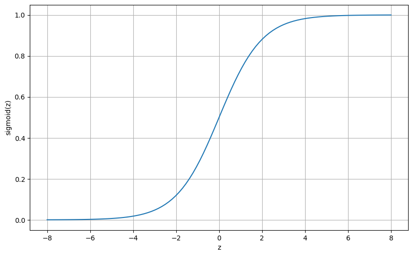
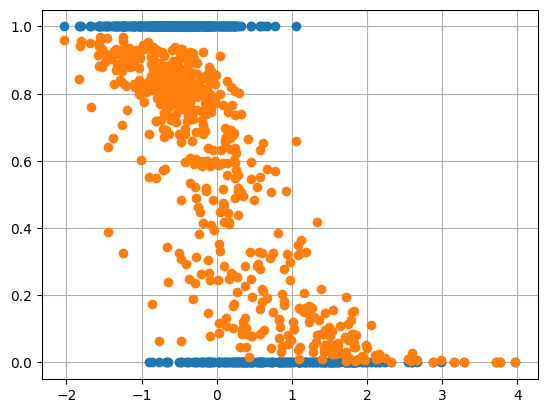

---
authors:
  - d33kshant
categories:
  - Tutorial
date: 2024-05-28
pin: true
description: >-
  Let's dive into logistic regression, a fundamental classification algorithm. We'll implement it from scratch, break down the code step by step, and demonstrate its application on a popular dataset.
---

# Implementing Logistic Regression from Scratch

Let's dive into logistic regression, a fundamental classification algorithm. We'll implement it from scratch, break down the code step by step, and demonstrate its application on a popular dataset.

<!-- more -->

[](https://colab.research.google.com/drive/1UzACrMpQtV3irBxH2E27vz5Dw9nNt1AG)

???+ abstract "AI Summary"
    The document provides a comprehensive tutorial on implementing logistic regression from scratch, a fundamental classification algorithm used for binary prediction tasks. It explains the mathematical foundations of logistic regression, including the sigmoid function and decision boundary, and demonstrates a step-by-step implementation using NumPy on the Breast Cancer dataset. The tutorial covers data preparation, model training, prediction, and evaluation, comparing the manual implementation with Scikit-Learn's approach and achieving high accuracy in classifying cancer data.

## What is Logistic Regression?

Logistic Regression is a linear model used for classification. It applies a logistic (sigmoid) function to the linear combination of input features to predict a probability between 0 and 1.

### Sigmoid Function
The sigmoid function is defined as follows:

\[
sigmoid(z) = \frac{1}{1 + e^{-z}}
\]

Here \( z = w^T x + b \) is the linear combination of weights and inputs. \( w \) are the model weights, \( b \) is the bias.

{ width="500" }
/// caption
Sigmoid Curve
///

### Decision Boundary
The model predicts a class based on a threshold, typically 0.5:

\[
\hat{y} = \begin{cases}
1 & \text{if } \sigma(z) \ge 0.5 \\
0 & \text{if } \sigma(z) < 0.5
\end{cases}
\]

## Implementation of Logistic Regression

### 1. Importing the Libraries
```python
import numpy as np
import pandas as pd
from sklearn import datasets
import matplotlib.pyplot as plt
```

### 2. Preparing the Dataset
```python
data = datasets.load_breast_cancer()
X = data.data
y = data.target

# Normalize the features
X = (X - X.mean(axis=0)) / X.std(axis=0)

# Add intercept term
X = np.c_[np.ones((X.shape[0], 1)), X]
```
We load the Breast Cancer dataset. Normalize the features to ensure they are on a similar scale. Add an intercept (bias) term with a column of ones.

### 3. Building and Training of the Model

```python
def sigmoid(z):
    return 1 / (1 + np.exp(-z))
```
Above code is the implementation of the sigmoid function.

```python
def logistic_regression(X, y, alpha=0.01, epochs=100):
    m = len(y)
    w, b = np.zeros(X.shape[1]), 0
    for _ in range(epochs):
        z = np.dot(X, w) + b
        predictions = sigmoid(z)
        w -= alpha * np.dot(X.T, (predictions - y)) / m
        b -= alpha * np.mean(predictions - y)
    return w, b
```

The alogrithm used for the learning is Gradient Descent 

### 4. Making Predictions and Evaluating the Model

```python
def predict(X, w, b):
    return (sigmoid(np.dot(X, w) + b) >= 0.5).astype(int)

w, b = logistic_regression(X, y)
y_pred = predict(X, w, b)
accuracy = np.mean(y_pred == y)
print(f"Accuracy: {accuracy * 100:.2f}%")
```

<div class="result" markdown>
Accuracy: 94.55%
</div>


## Visualizing the Results

```python
plt.scatter(X[:, 1], y, zorder=2)
plt.scatter(X[:, 1], sigmoid(np.dot(X, w) + b), zorder=2)
plt.grid()
plt.show()
```
<div class="result" markdown>

</div>


## Implementing Logistic Regression using Scikit-Learn
```python
from sklearn.linear_model import LogisticRegression

model = LogisticRegression()
model.fit(X[:, 1:], y)
sklearn_accuracy = model.score(X[:, 1:], y)
print(f"Sklearn Accuracy: {sklearn_accuracy * 100:.2f}%")
```
<div class="result" markdown>
Sklearn Accuracy: 98.77%
</div>


## Conclusion
Logistic Regression is a powerful yet simple algorithm for binary classification tasks. Implementing it from scratch helps in understanding the core concepts of model building, optimization, and evaluation. By leveraging libraries like NumPy and pandas, we can gain a deeper insight into how logistic regression works under the hood.
