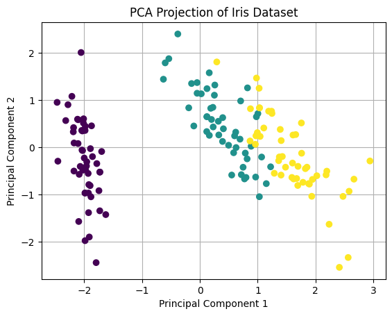
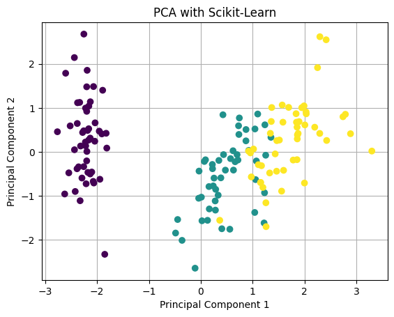

---
authors:
  - d33kshant
categories:
  - Tutorial
date: 2024-06-07
description: >-
    Principal Component Analysis (PCA) is a widely used technique for reducing the dimensionality of datasets while retaining the most important information. It does this by transforming correlated variables into a smaller set of uncorrelated variables called principal components.
---

# Implementing Principal Component Analysis (PCA) from Scratch

Principal Component Analysis (PCA) is a widely used technique for reducing the dimensionality of datasets while retaining the most important information. It does this by transforming correlated variables into a smaller set of uncorrelated variables called principal components.

<!-- more -->

[](https://colab.research.google.com/drive/1MHGK5qoNfMNRH-5NbBzCYxdCTAhU1szs)

???+ ai-summary "AI Summary"
    This document explains Principal Component Analysis (PCA), a dimensionality reduction technique that transforms correlated variables into a smaller set of uncorrelated principal components. It provides a step-by-step implementation from scratch using NumPy and Pandas on the Iris dataset, covering data standardization, covariance matrix computation, eigenvalue/eigenvector calculation, and data projection. The tutorial includes visualizations of the transformed data, compares the manual implementation with Scikit-Learn's approach, and emphasizes PCA's value for feature selection, noise reduction, and data visualization in machine learning workflows.

PCA is useful in scenarios where we have high-dimensional data and want to reduce complexity, remove noise, and visualize patterns more easily. Some common applications include image compression, feature extraction, and speeding up machine learning models.

## How PCA Works

PCA follows these key steps:

1. **Standardization**: Ensure that all features contribute equally by normalizing the dataset.
2. **Compute Covariance Matrix**: Measure how features vary together.
3. **Compute Eigenvalues and Eigenvectors**: Identify principal components in the data.
4. **Sort and Select Principal Components**: Choose components with the highest variance.
5. **Transform Data**: Project the original data onto the new feature space.

Mathematically, given a dataset \(X\) of shape \(m \times n\), where \(m\) is the number of samples and \(n\) is the number of features, PCA finds a transformation matrix \(W\) such that:

\[
Z = X W
\]

where \(Z\) represents the data in the new reduced-dimensional space.

Now, let's implement PCA from scratch using NumPy and Pandas.

---

## Implementing PCA from Scratch

### 1. Importing Necessary Libraries

```python
import numpy as np
import pandas as pd
import matplotlib.pyplot as plt
from sklearn.datasets import load_iris
```

### 2. Preparing the Dataset
We will use the famous Iris dataset, which contains four features.

```python
dataset = load_iris()
X = pd.DataFrame(dataset.data, columns=dataset.feature_names)
y = dataset.target
```

### 3. Standardizing the Data

Since PCA is affected by scale, we standardize the dataset to have mean \(0\) and variance \(1\).

```python
X_std = (X - X.mean()) / X.std()
```

### 4. Computing the Covariance Matrix

The covariance matrix captures relationships between features.

```python
cov_matrix = np.cov(X.T)
```

### 5. Computing Eigenvalues and Eigenvectors

Eigenvalues represent the variance explained by each component, and eigenvectors define the principal components.

```python
eigenvalues, eigenvectors = np.linalg.eig(cov_matrix)
```

### 6. Sorting Eigenvectors by Eigenvalues

We sort components by the amount of variance they capture.

```python
sorted_indices = np.argsort(eigenvalues)[::-1]
eigenvalues = eigenvalues[sorted_indices]
eigenvectors = eigenvectors[:, sorted_indices]
```

### 7. Selecting the Top Principal Components

We select the top \(k\) components. Here, we choose \(k=2\) for visualization.

```python
k = 2
W = eigenvectors[:, :k]
```

### 8. Projecting Data onto New Feature Space

Finally, we transform our dataset using the selected principal components.

```python
X_pca = np.dot(X_std, W)
```

### 9. Visualizing the Results

```python
plt.scatter(X_pca[:, 0], X_pca[:, 1], c=y, cmap='viridis', zorder=2)
plt.xlabel('Principal Component 1')
plt.ylabel('Principal Component 2')
plt.title('PCA Projection of Iris Dataset')
plt.grid()
plt.show()
```
<div class="result" markdown>
{ width="400" }
</div>

## Implementing PCA Using Scikit-Learn

While implementing PCA from scratch provides a deeper understanding, real-world applications often use Scikit-Learn for efficiency.

```python
from sklearn.decomposition import PCA

pca = PCA(n_components=2)
X_pca_sklearn = pca.fit_transform(X_std)

plt.scatter(X_pca_sklearn[:, 0], X_pca_sklearn[:, 1], c=y, cmap='viridis', zorder=2)
plt.xlabel('Principal Component 1')
plt.ylabel('Principal Component 2')
plt.title('PCA with Scikit-Learn')
plt.grid()
plt.show()
```
<div class="result" markdown>
{ width="400" }
</div>

## Conclusion

PCA is a powerful dimensionality reduction technique that helps in feature selection, noise reduction, and data visualization. By implementing PCA from scratch, we gain insights into its inner workings. However, in practical scenarios, using libraries like Scikit-Learn makes it easier to apply PCA efficiently. Whether from scratch or using libraries, PCA remains a fundamental tool in data science and machine learning.
