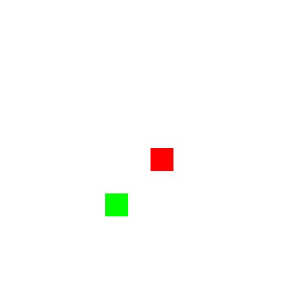

---
authors:
  - d33kshant
categories:
  - Tutorial
date: 2024-11-10
description: >-
    Have you ever wondered how an AI agent can learn to play a game—like Snake, Pac-Man, or even chess—just by trial and error? Behind the scenes, a powerful concept called Q-learning is often at work. Q-learning is a model-free reinforcement learning algorithm. That means the agent doesn’t need to know the rules of the environment—it learns them by experience.
---

# Implementing Q Learning from Scratch

Have you ever wondered how an AI agent can learn to play a game—like Snake, Pac-Man, or even chess—just by trial and error? Behind the scenes, a powerful concept called Q-learning is often at work. Q-learning is a model-free reinforcement learning algorithm. That means the agent doesn’t need to know the rules of the environment—it learns them by experience.

<!-- more -->

[](https://colab.research.google.com/drive/1Le3CKVlJ7HOvXjaKSijIqpr9Mb40X8kQ?usp=sharing)

???+ abstract "AI Summary"
    This blog introduces Q-learning, a reinforcement learning algorithm that enables agents to learn optimal actions through trial and error. It covers the key components—states, actions, rewards, and the Q-table—and explains how the agent updates its knowledge using the Bellman equation. With a balance of exploration and exploitation, Q-learning helps agents improve their behavior over time without needing a model of the environment.

## What is Q-Learning?

**Q-learning** is a type of **reinforcement learning** algorithm that helps an agent learn *what action to take in each state* to maximize its total reward—*purely through trial and error*. It doesn’t require a model of the environment, making it **model-free**.

## Key Components in Q-Learning

- **Agent**: The decision-maker (e.g., a snake in the Snake game).

- **Environment**: The world the agent interacts with (e.g., a grid).

- **State** \( s \): A snapshot of the environment.

- **Action** \( a \): A move the agent can take.

- **Reward** \( r \): Feedback received after an action.

- **Q-table** \( Q(s, a) \): Stores the expected future rewards for each action in each state.  


## How Q-Learning Works

The agent learns by updating Q-values using the **Bellman equation**:

\[
Q(s, a) \leftarrow Q(s, a) + \alpha \left[ r + \gamma \max_{a'} Q(s', a') - Q(s, a) \right]
\]

Where:

- \( \alpha \): Learning rate (how quickly it learns)

- \( \gamma \): Discount factor (importance of future rewards)

- \( r \): Immediate reward

- \( s' \): New state after taking action \( a \)

- \( \max_{a'} Q(s', a') \): Best possible future reward from next state.  

Over time, the agent uses an **explore-exploit strategy** to balance learning new actions (exploration) and choosing the best-known actions (exploitation), improving the Q-table until it converges to optimal behavior.

## Implementation of Q-Learning

### 1. Importing the Libraries

```python
import numpy as np
import matplotlib.pyplot as plt
import matplotlib.animation as animation
from IPython.display import HTML
import random
from collections import defaultdict
```

### 2. Declare Constant Values

```python
# Constants
GRID_SIZE = 10
EPISODES = 500
MAX_STEPS = 100
EPSILON_DECAY = 0.995
MIN_EPSILON = 0.01
ALPHA = 0.1
GAMMA = 0.9

# Directions
UP = 0
DOWN = 1
LEFT = 2
RIGHT = 3
DIRECTION_VECTORS = [(-1, 0), (1, 0), (0, -1), (0, 1)]

# Colors
RED = [255, 0, 0]
GREEN = [0, 255, 0]
```

### 3. Creating the Snake's Environment

```python
class SnakeEnv:
    def __init__(self, size=GRID_SIZE):
        self.size = size
        self.reset()

    def reset(self):
        self.snake = [(self.size // 2, self.size // 2)]
        self.direction = random.choice([UP, DOWN, LEFT, RIGHT])
        self.place_food()
        self.done = False
        return self.get_state()

    def place_food(self):
        while True:
            self.food = (random.randint(0, self.size - 1), random.randint(0, self.size - 1))
            if self.food not in self.snake:
                break

    def get_state(self):
        head = self.snake[0]
        dir_vector = DIRECTION_VECTORS[self.direction]
        food_dir = (np.sign(self.food[0] - head[0]), np.sign(self.food[1] - head[1]))
        danger = self.check_danger()
        return (dir_vector, food_dir, danger)

    def check_danger(self):
        head = self.snake[0]
        danger = []
        for d in range(4):
            dx, dy = DIRECTION_VECTORS[d]
            nx, ny = head[0] + dx, head[1] + dy
            if (nx < 0 or nx >= self.size or ny < 0 or ny >= self.size or (nx, ny) in self.snake):
                danger.append(1)
            else:
                danger.append(0)
        return tuple(danger)

    def step(self, action):
        if self.done:
            return self.get_state(), 0, self.done

        self.direction = action
        dx, dy = DIRECTION_VECTORS[self.direction]
        head = self.snake[0]
        new_head = (head[0] + dx, head[1] + dy)

        if (new_head in self.snake or 
            not (0 <= new_head[0] < self.size) or 
            not (0 <= new_head[1] < self.size)):
            self.done = True
            return self.get_state(), -10, True

        self.snake.insert(0, new_head)

        if new_head == self.food:
            self.place_food()
            reward = 10
        else:
            self.snake.pop()
            reward = -0.1

        return self.get_state(), reward, self.done

    def render(self):
        grid = np.zeros((self.size, self.size, 3), dtype=np.uint8)
        grid[:, :] = 255
        for (x, y) in self.snake:
            grid[x, y] = RED
        fx, fy = self.food
        grid[fx, fy] = GREEN
        return grid
```

### 4. The Q-Learning Agent

```python
class QLearningAgent:
    def __init__(self, actions):
        self.q_table = defaultdict(lambda: np.zeros(len(actions)))
        self.actions = actions
        self.epsilon = 1.0

    def get_action(self, state):
        state_key = str(state)
        if np.random.rand() < self.epsilon:
            return random.choice(self.actions)
        else:
            return int(np.argmax(self.q_table[state_key]))

    def learn(self, state, action, reward, next_state):
        state_key = str(state)
        next_state_key = str(next_state)
        predict = self.q_table[state_key][action]
        target = reward + GAMMA * np.max(self.q_table[next_state_key])
        self.q_table[state_key][action] += ALPHA * (target - predict)
```

### 5. Training the Agent In The Environment

```python
env = SnakeEnv()
agent = QLearningAgent(actions=[UP, DOWN, LEFT, RIGHT])

for episode in range(EPISODES):
    state = env.reset()
    total_reward = 0
    for _ in range(MAX_STEPS):
        action = agent.get_action(state)
        next_state, reward, done = env.step(action)
        agent.learn(state, action, reward, next_state)
        state = next_state
        total_reward += reward
        if done:
            break
    agent.epsilon = max(MIN_EPSILON, agent.epsilon * EPSILON_DECAY)
    if (episode + 1) % 100 == 0:
        print(f"Episode {episode+1}, Total reward: {total_reward:.3f}, Epsilon: {agent.epsilon:.3f}")
```
<div class="result" markdown>
<pre>
Episode 100, Total reward: -14.200, Epsilon: 0.606
Episode 200, Total reward: -11.500, Epsilon: 0.367
Episode 300, Total reward: 8.100, Epsilon: 0.222
Episode 400, Total reward: -0.600, Epsilon: 0.135
Episode 500, Total reward: 16.900, Epsilon: 0.082
</pre>
</div>

### 6. Visualizing The Training

```python
frames = []
state = env.reset()

fig = plt.figure(figsize=(5, 5))
plt.axis("off")

for _ in range(100):
    grid = env.render()
    im = plt.imshow(grid, animated=True)
    frames.append([im])
    action = agent.get_action(state)
    state, _, done = env.step(action)
    if done:
        break

ani = animation.ArtistAnimation(fig, frames, interval=200, blit=True)
plt.close()
HTML(ani.to_jshtml())
```
<div class="result" markdown>

</div>

## Conclusion
Q-learning is a simple yet powerful way for agents to learn optimal behavior by interacting with their environment. With just a table of values and a smart update rule, it allows agents to improve over time—learning entirely from rewards, not instructions. It's a foundational technique in reinforcement learning and a great starting point for building intelligent systems.