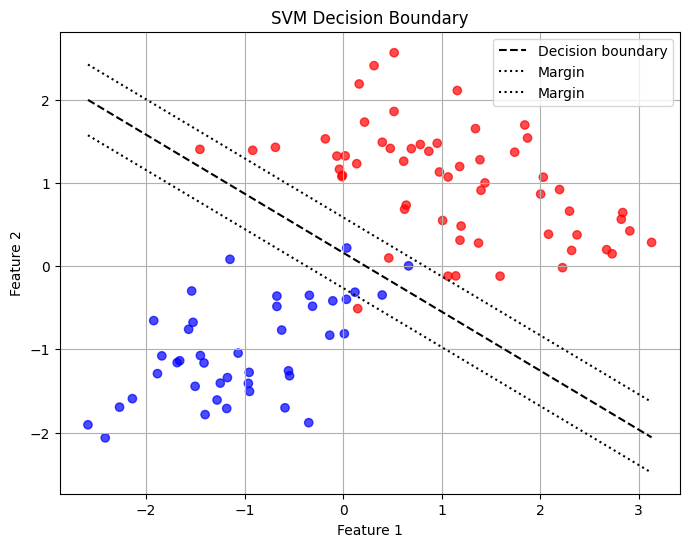
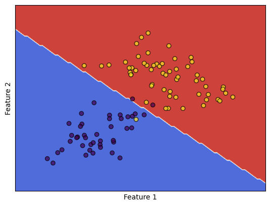

---
authors:
  - d33kshant
categories:
  - Tutorial
date: 2024-06-15
description: >-
    Support Vector Machine (SVM) is a powerful supervised learning algorithm used for classification and regression tasks. It works by finding the optimal hyperplane that best separates data points of different classes while maximizing the margin between them. SVM is especially effective in high-dimensional spaces and robust to outliers.
---

# Implementing SVM from Scratch

Support Vector Machine (SVM) is a powerful supervised learning algorithm used for classification and regression tasks. It works by finding the optimal hyperplane that best separates data points of different classes while maximizing the margin between them. SVM is especially effective in high-dimensional spaces and robust to outliers.


<!-- more -->

[](https://colab.research.google.com/drive/1kYJQ5inHkcy2RoR6WcCzaUwic9r_TFAk?usp=sharing)

???+ abstract "AI Summary"
    In this blog, we explored the fundamentals of Support Vector Machines, starting from the theory behind how they work to a detailed step-by-step implementation using only NumPy and pandas. We built a linear SVM from scratch without relying on object-oriented programming, applied it to a real dataset, and visualized the decision boundaries to better understand the model's behavior. We then demonstrated how easily the same task can be accomplished using scikit-learn. This hands-on approach not only reinforces the theoretical concepts but also provides practical insights into building machine learning models from the ground up.

## What is Support Vector Machine?

Support Vector Machine (SVM) is a powerful supervised learning algorithm used for classification and regression tasks. It is especially effective for high-dimensional spaces and situations where the number of dimensions exceeds the number of samples.

The core idea behind SVM is to find the hyperplane that best separates the data points of different classes. The optimal hyperplane is the one that maximizes the **margin**, which is the distance between the hyperplane and the nearest data point of each class. These nearest points are called **support vectors**.

## How Does SVM Work?

Mathematically, given a labeled training dataset \((x_i, y_i)\) where \(x_i \in \mathbb{R}^n\) and \(y_i \in \{-1, 1\}\), the objective of the linear SVM is to find a weight vector \(w\) and bias \(b\) such that the decision function:

\[
f(x) = w^T x + b
\]

correctly classifies the data while maximizing the margin.

The optimization problem becomes:

\[
\min_{w, b} \frac{1}{2} \|w\|^2 \\
\text{ subject to } y_i (w^T x_i + b) \geq 1
\]

This is a **convex quadratic optimization problem**, and we can solve it using **gradient descent** on a hinge loss function with regularization:

\[
\text{Loss} = \frac{1}{2} \|w\|^2 + C \sum_{i} \max(0, 1 - y_i (w^T x_i + b))
\]


## Implementation of Support Vector Machine

### 1. Importing the Libraries

```python
import numpy as np
import pandas as pd
import matplotlib.pyplot as plt
from sklearn.datasets import make_classification
from sklearn.model_selection import train_test_split
```

We import essential libraries: NumPy for numerical computation, pandas for data manipulation, and matplotlib for visualization. We also use `make_classification` to create a synthetic dataset.

### 2. Preparing the Dataset

```python
X, y = make_classification(
    n_samples=500, n_features=2,
    n_redundant=0, n_informative=2,
    n_clusters_per_class=1,
)

# Convert labels from {0, 1} to {-1, 1}
y = np.where(y == 0, -1, 1)

X_train, X_test, y_train, y_test = train_test_split(
    X, y,
    test_size=0.2,
)
```

We generate a simple 2D binary classification dataset. The labels are converted to \{-1, 1\} as required by the SVM formulation.


### 3. Building and Training the Model

```python
def hinge_loss(w, b, X, y, C):
    distances = 1 - y * (np.dot(X, w) + b)
    distances = np.maximum(0, distances)
    loss = 0.5 * np.dot(w, w) + C * np.sum(distances)
    return loss
```

This function calculates the hinge loss with L2 regularization. The term `np.dot(w, w)` penalizes large weights, encouraging a larger margin.


```python
def compute_gradients(w, b, X, y, C):
    distances = 1 - y * (np.dot(X, w) + b)
    dw = np.zeros_like(w)
    db = 0

    for i, d in enumerate(distances):
        if d > 0:
            dw += -C * y[i] * X[i]
            db += -C * y[i]
        else:
            continue

    dw += w
    return dw, db
```

We compute gradients of the hinge loss for gradient descent updates. When a sample violates the margin, it contributes to the loss.


```python
def train_svm(X, y, C=1.0, learning_rate=0.001, epochs=1000):
    n_samples, n_features = X.shape
    w = np.zeros(n_features)
    b = 0

    for epoch in range(epochs):
        dw, db = compute_gradients(w, b, X, y, C)
        w -= learning_rate * dw
        b -= learning_rate * db

        if epoch % 100 == 0:
            loss = hinge_loss(w, b, X, y, C)
            print(f"Epoch {epoch}: Loss = {loss:.4f}")

    return w, b
```

We use simple gradient descent to minimize the loss. Every 100 epochs we print the current loss to monitor training progress.


```python
w, b = train_svm(X_train, y_train, C=1.0, learning_rate=0.001, epochs=1000)
```
<div class="result" markdown>
<pre>
Epoch 0: Loss = 127.0344
Epoch 100: Loss = 39.6987
Epoch 200: Loss = 38.9753
Epoch 300: Loss = 38.9016
Epoch 400: Loss = 38.8979
Epoch 500: Loss = 38.8956
Epoch 600: Loss = 38.8929
Epoch 700: Loss = 38.8929
Epoch 800: Loss = 38.8923
Epoch 900: Loss = 38.8924
</pre>
</div>

We train the model using the training data.


### 4. Making Predictions and Evaluation

```python
def predict(X, w, b):
    return np.sign(np.dot(X, w) + b)

y_pred = predict(X_test, w, b)
accuracy = np.mean(y_pred == y_test)
print(f"Test Accuracy: {accuracy * 100:.2f}%")
```
<div class="result" markdown>
Test Accuracy: 97.00%
</div>

We use the learned parameters to make predictions on the test set and evaluate accuracy.


### 5. Visualization Decision Boundary

```python
plt.figure(figsize=(8,6))
plt.scatter(X_test[:, 0], X_test[:, 1], c=y_test, cmap='bwr', alpha=0.7)

x0 = np.linspace(X_test[:, 0].min(), X_test[:, 0].max(), 100)
x1 = -(w[0] * x0 + b) / w[1]

margin = 1 / np.linalg.norm(w)
x1_plus = x1 + margin
x1_minus = x1 - margin

plt.plot(x0, x1, 'k--', label='Decision boundary')
plt.plot(x0, x1_plus, 'k:', label='Margin')
plt.plot(x0, x1_minus, 'k:', label='Margin')
plt.legend()
plt.grid()
plt.title('SVM Decision Boundary')
plt.xlabel('Feature 1')
plt.ylabel('Feature 2')
plt.show()
```
<div class="result" markdown>

</div>

We plot the decision boundary and margins. Support vectors are not explicitly marked, but they lie closest to the boundary.


## Implementation using Scikit-learn

```python
from sklearn.svm import SVC

clf = SVC(kernel='linear', C=1.0)
clf.fit(X_train, y_train)
print(f"Test Accuracy: {clf.score(X_test, y_test) * 100:.2f}%")
```
<div class="result" markdown>
Test Accuracy: 97.00%
</div>

```python
from sklearn.inspection import DecisionBoundaryDisplay

disp = DecisionBoundaryDisplay.from_estimator(
    clf,
    X_test,
    response_method="predict",
    xlabel="Feature 1",
    ylabel="Feature 2",
    cmap=plt.cm.coolwarm,
)

disp.ax_.scatter(X_test[:, 0], X_test[:, 1], c=y_test, edgecolor="k", alpha=0.7)
disp.ax_.set_xticks([])
disp.ax_.set_yticks([])
plt.show()
```
<div class="result" markdown>

</div>

## Conclusion

Support Vector Machines are elegant, powerful classifiers rooted in convex optimization. While libraries like scikit-learn make it easy to use SVMs in practice, building one from scratch helps in deeply understanding how margin-based classifiers operate under the hood. Through a step-by-step approach using NumPy and pandas, we demystified the algorithm and gave you a peek into its mathematical foundation.
