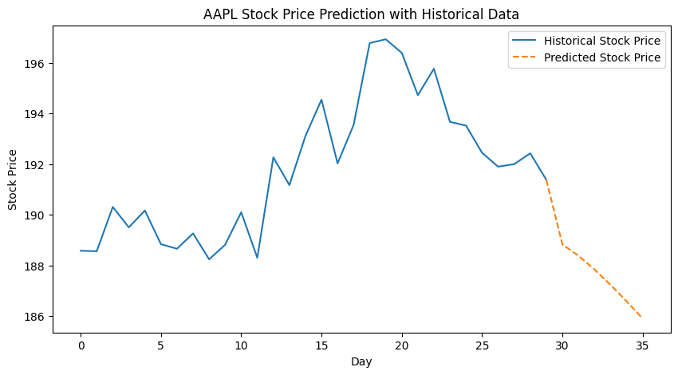

---
authors:
  - d33kshant
categories:
  - Mini Projects
date: 2024-08-03
description: >-
    This mini project demonstrates how to use a Long Short-Term Memory (LSTM) neural network to predict stock prices based on historical data.
---

# Stock Price Prediction with LSTM

This mini project demonstrates how to use a Long Short-Term Memory (LSTM) neural network to predict stock prices based on historical data.

<!-- more -->

Using TensorFlow and Yahoo Finance, the model is trained on past stock prices and forecasts the next seven days. The data is preprocessed with MinMax scaling, and the model architecture includes multiple LSTM layers, dropout for regularization, and dense layers for prediction.


[](https://colab.research.google.com/drive/1bpPZ1RGcePPlbzrtTKpz4GPmTAGo9zpP?usp=sharing)


## Import required libraries
```python
import numpy as np
import pandas as pd
import matplotlib.pyplot as plt
import tensorflow as tf
from tensorflow.keras.models import Sequential
from tensorflow.keras.layers import LSTM, Dense, Dropout
from sklearn.preprocessing import MinMaxScaler
import yfinance as yf
```

## Download stock data
```python
def get_stock_data(ticker, start, end):
    df = yf.download(ticker, start=start, end=end)
    return df['Close'].values.reshape(-1, 1)
```

## Preprocess data
```python
def prepare_data(data, time_steps):
    X, y = [], []
    for i in range(len(data) - time_steps):
        X.append(data[i:i+time_steps])
        y.append(data[i+time_steps])
    return np.array(X), np.array(y)
```

## Load and preprocess data
```python
ticker = "AAPL"  # Apple stock
start_date = "2020-01-01"
end_date = "2024-01-01"

data = get_stock_data(ticker, start_date, end_date)
scaler = MinMaxScaler()
data_scaled = scaler.fit_transform(data)
```
<div class="result" markdown>
<pre style="font-size:.85em; overflow-x:auto;">
[*********************100%***********************]  1 of 1 completed
</pre>
</div>

## Create training dataset
```python
time_steps = 60
X, y = prepare_data(data_scaled, time_steps)
X_train, y_train = X[:-30], y[:-30]  # Keep last 30 days for testing
X_test, y_test = X[-30:], y[-30:]
```

## Build LSTM model
```python
model = Sequential([
    LSTM(50, return_sequences=True, input_shape=(time_steps, 1)),
    Dropout(0.2),
    LSTM(50, return_sequences=False),
    Dropout(0.2),
    Dense(25, activation='relu'),
    Dense(1)
])

model.compile(optimizer='adam', loss='mean_squared_error')
```

## Train model
```python
# Train model
model.fit(
    X_train, y_train,
    epochs=10, batch_size=32,
    validation_data=(X_test, y_test)
)
```
<div class="result" markdown>
<pre style="font-size:.85em; overflow-x:auto;">Epoch 1/10
<span style="font-weight: bold;">29/29</span><span> </span><span style="color: var(--ansi-green);">━━━━━━━━━━━━━━━━━━━━</span><span> </span><span style="font-weight: bold;">2s</span><span> 54ms/step - loss: 0.0038 - val_loss: 0.0126
Epoch 2/10
</span><span style="font-weight: bold;">29/29</span><span> </span><span style="color: var(--ansi-green);">━━━━━━━━━━━━━━━━━━━━</span><span> </span><span style="font-weight: bold;">2s</span><span> 56ms/step - loss: 0.0041 - val_loss: 0.0109
Epoch 3/10
</span><span style="font-weight: bold;">29/29</span><span> </span><span style="color: var(--ansi-green);">━━━━━━━━━━━━━━━━━━━━</span><span> </span><span style="font-weight: bold;">2s</span><span> 57ms/step - loss: 0.0036 - val_loss: 0.0060
Epoch 4/10
</span><span style="font-weight: bold;">29/29</span><span> </span><span style="color: var(--ansi-green);">━━━━━━━━━━━━━━━━━━━━</span><span> </span><span style="font-weight: bold;">2s</span><span> 63ms/step - loss: 0.0034 - val_loss: 0.0113
Epoch 5/10
</span><span style="font-weight: bold;">29/29</span><span> </span><span style="color: var(--ansi-green);">━━━━━━━━━━━━━━━━━━━━</span><span> </span><span style="font-weight: bold;">3s</span><span> 68ms/step - loss: 0.0039 - val_loss: 0.0076
Epoch 6/10
</span><span style="font-weight: bold;">29/29</span><span> </span><span style="color: var(--ansi-green);">━━━━━━━━━━━━━━━━━━━━</span><span> </span><span style="font-weight: bold;">2s</span><span> 53ms/step - loss: 0.0031 - val_loss: 0.0077
Epoch 7/10
</span><span style="font-weight: bold;">29/29</span><span> </span><span style="color: var(--ansi-green);">━━━━━━━━━━━━━━━━━━━━</span><span> </span><span style="font-weight: bold;">2s</span><span> 55ms/step - loss: 0.0029 - val_loss: 0.0074
Epoch 8/10
</span><span style="font-weight: bold;">29/29</span><span> </span><span style="color: var(--ansi-green);">━━━━━━━━━━━━━━━━━━━━</span><span> </span><span style="font-weight: bold;">2s</span><span> 54ms/step - loss: 0.0028 - val_loss: 0.0117
Epoch 9/10
</span><span style="font-weight: bold;">29/29</span><span> </span><span style="color: var(--ansi-green);">━━━━━━━━━━━━━━━━━━━━</span><span> </span><span style="font-weight: bold;">2s</span><span> 55ms/step - loss: 0.0031 - val_loss: 0.0100
Epoch 10/10
</span><span style="font-weight: bold;">29/29</span><span> </span><span style="color: var(--ansi-green);">━━━━━━━━━━━━━━━━━━━━</span><span> </span><span style="font-weight: bold;">2s</span><span> 64ms/step - loss: 0.0030 - val_loss: 0.0024
</span></pre>
</div>

## Predict the next 7 days
```python
last_sequence = data_scaled[-time_steps:].reshape(1, time_steps, 1)
predicted_values = []

for _ in range(7):
    next_pred = model.predict(last_sequence)
    predicted_values.append(next_pred[0, 0])
    last_sequence = np.append(last_sequence[:, 1:, :], next_pred.reshape(1, 1, 1), axis=1)

predicted_values = scaler.inverse_transform(np.array(predicted_values).reshape(-1, 1))
```
<div class="result" markdown>
<pre style="font-size:.85em; overflow-x:auto;"><span style="font-weight: bold;">1/1</span><span> </span><span style="color: var(--ansi-green);">━━━━━━━━━━━━━━━━━━━━</span><span> </span><span style="font-weight: bold;">0s</span><span> 492ms/step
</span><span style="font-weight: bold;">1/1</span><span> </span><span style="color: var(--ansi-green);">━━━━━━━━━━━━━━━━━━━━</span><span> </span><span style="font-weight: bold;">0s</span><span> 67ms/step
</span><span style="font-weight: bold;">1/1</span><span> </span><span style="color: var(--ansi-green);">━━━━━━━━━━━━━━━━━━━━</span><span> </span><span style="font-weight: bold;">0s</span><span> 77ms/step
</span><span style="font-weight: bold;">1/1</span><span> </span><span style="color: var(--ansi-green);">━━━━━━━━━━━━━━━━━━━━</span><span> </span><span style="font-weight: bold;">0s</span><span> 67ms/step
</span><span style="font-weight: bold;">1/1</span><span> </span><span style="color: var(--ansi-green);">━━━━━━━━━━━━━━━━━━━━</span><span> </span><span style="font-weight: bold;">0s</span><span> 78ms/step
</span><span style="font-weight: bold;">1/1</span><span> </span><span style="color: var(--ansi-green);">━━━━━━━━━━━━━━━━━━━━</span><span> </span><span style="font-weight: bold;">0s</span><span> 72ms/step
</span><span style="font-weight: bold;">1/1</span><span> </span><span style="color: var(--ansi-green);">━━━━━━━━━━━━━━━━━━━━</span><span> </span><span style="font-weight: bold;">0s</span><span> 76ms/step
</span></pre>
</div>

## Align the predicted values with historical data
```python
historical_days = len(data[-30:])
predicted_days = list(range(historical_days - 1, historical_days + 6))
```

## Plot results
```python
plt.figure(figsize=(10, 5))
plt.plot(range(historical_days), data[-30:], label='Historical Stock Price', linestyle='dashed')
plt.plot(predicted_days, np.insert(predicted_values, 0, data[-1]), marker='o', label='Predicted Stock Price')
plt.xlabel("Day")
plt.ylabel("Stock Price")
plt.title(f"{ticker} Stock Price Prediction with Historical Data")
plt.legend()
plt.show()
```
<div class="result" markdown>

</div>